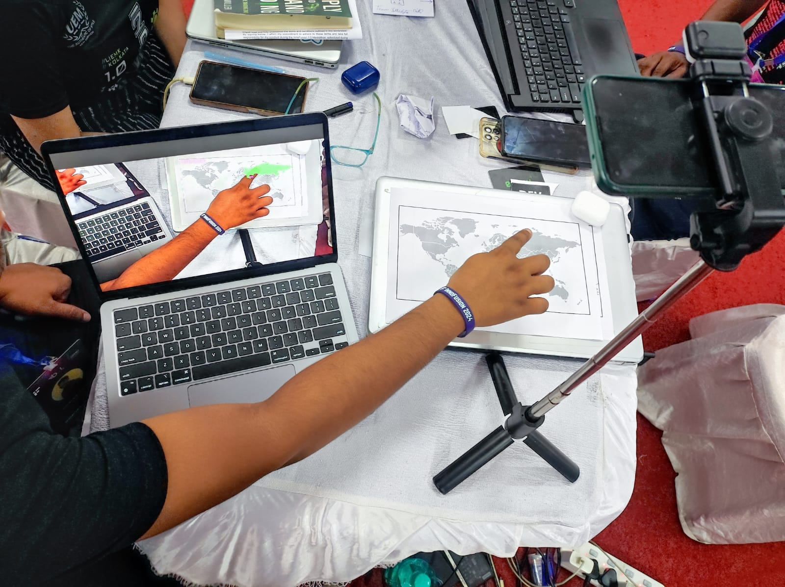

<h1 align="center"> EduFusion - Where learning meets exploration </h1>

Promoting Quality Education through Interactive Knowledge Visualization and Advanced Insights 

<h2>Made with ❤ by Team Yottabyte   @ INNOFUSION 1.0</h2>

## Acknowledgement 🙏
We, team Yottabyte, would like to extend our gratitude to the organizers of INNOFUSION for providing us with the opportunity to participate in the hackathon and showcase our project, EduFusion.   
Special thanks to the developers of Python, OpenCV, Flask, HTML, CSS, JavaScript, jQuery, Bootstrap, GitHub, and pytest for their invaluable contributions to the technologies that powered our project.  
Last but not least, we appreciate the collaborative efforts of our team members who dedicated their time and skills to bring EduFusion to fruition during the intense 30-hour hackathon.

## Theme
Quality Education

## Domain
Web and App Development

## Problem ✒
Traditional education lacks interactive tools, resulting in disengagement and limited retention of knowledge. Static maps and textbooks fail to provide immersive learning experiences, hindering effective exploration of knowledge.

## Solution 🏆
EduFusion addresses this problem by offering an interactive learning platform where users can physically interact with a map, explore countries, and engage in educational games. By integrating physical touch with digital technology, EduFusion provides a hands-on approach to learning geography, fostering deeper understanding and retention of geographical knowledge.

## Introduction to EduFusion 💥
EduFusion: an interactive educational tool revolutionizing geography exploration. Seamlessly blending physical and digital interaction, users touch a physical map to trigger digital responses, fostering hands-on exploration of countries, continents, and geographic features. Ideal for students, educators, and geography enthusiasts, EduFusion enhances learning experiences with engaging activities and games. Whether deepening understanding, enhancing classroom instruction, or satisfying curiosity, EduFusion offers an immersive solution. Join us on this journey as we navigate the world's wonders, one touch at a time.

## Technology Stack 👨‍💻
- Python
- OpenCV
- Numpy
- pickle
- HTML, CSS, JavaScript
- Frontend Libraries (e.g., jQuery, Bootstrap)
- Version Control (e.g., Git)

## Future Scope
- <b> Multi-Subject Expansion:</b> Extend beyond geography to include subjects like history, science, mathematics, and languages, offering a comprehensive educational platform.
- <b> Interactive Simulations:</b> Develop educational games and simulations that enhance engagement and retention of knowledge through interactive challenges and real-world scenarios.
- <b>Partnerships with Educational Institutions:</b> Collaborate with schools, universities, and educational organizations to integrate EdTouch into formal educational curricula and extracurricular activities.

## Conclusion 🔥
EduFusion revolutionizes geography education by offering an interactive and immersive learning experience. By combining physical interaction with digital technology, EduFusion bridges the gap between traditional learning methods and modern educational tools. Start exploring the world with EduFusion today!

## Authors 🙇‍♂️👨‍💻
<table align="center">
  <tbody>
  	<tr>
      <td align="center" valign="top" style="width:25%" border-radius="5%">
        
         
        <a href="https://skriyaz.co/">Sk Riyaz</a>
        
Author

      </td>
      <td align="center" valign="top" style="width:25%">
        
         
        <a href="https://github.com/siddharthapal8240">Siddhartha Pal</a>
        
Author

      </td>
      <td align="center" valign="top" style="width:25%" border-radius="5%">
        
         
        <a href="https://github.com/Sahelighosh45">Ronit Pal</a>
        
Author

      </td>
      <td align="center" valign="top" style="width:25%" border-radius="5%">
        
         
        <a href="https://github.com/senroshni19">Poulomi Das</a>
        
Author

      </td>
    </tr>
    </tbody>
    </table>
